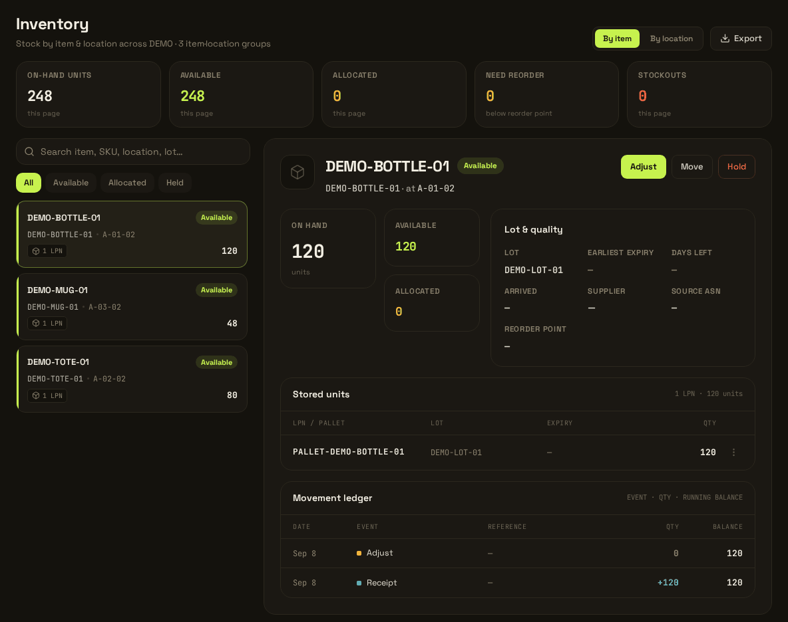

# Karyo WMS

[](LICENSE)
[](https://github.com/voyagerforge-dev/karyo-wms/actions/workflows/ci.yml)

**Know what arrived, where it is, and what needs to ship.**

Karyo is a self-hosted warehouse management system for warehouse teams and the developers who
support them. It connects receiving, stock locations and floor work with picking, packing and
shipping, through a desktop console and a mobile progressive web app (PWA).



## What Karyo does

Karyo runs a physical warehouse. Goods arrive against an advance shipping notice or blind, and are
received, quality-held or put away into locations. Stock is modelled per unit load and location,
and can be held, released and counted. Delivery orders allocate against it; operators pick, pack
and ship; pick faces are replenished; and every unit of work reaches a person through one work
inbox. Operators work from a scanner-driven floor app; planners and administrators work from a
desktop console. Reporting, webhooks, document rendering and a document archive are included.

The [user guide](docs/user-guide/README.md) shows each of these as a task, screen by screen.

**It suits** a team that wants a self-hosted WMS it can read, run and extend, and that has someone
willing to configure it for their warehouse and verify it before real stock moves.

**It is not** an unconfigured drop-in replacement for every operation. Shipping uses a built-in
manual carrier adapter, so a real carrier or ERP connection is an extension you write against the
published interfaces. There is no yard or labour management and no hosted service: you run it. One
instance serves one operating company, with goods owners inside it, rather than one shared instance
serving many companies.

## How it is built

- **One application, clear modules.** One Kotlin and Quarkus process, assembled from Gradle
  modules, over one PostgreSQL schema. Modules talk through typed interfaces and in-process events,
  not over the network, and they deploy together.
- **Four containers.** Compose runs the application, PostgreSQL, Keycloak and nginx. nginx serves
  both front ends from the same origin as the API. No Kubernetes cluster, message broker or cache
  service is required.
- **Ordinary state, purposeful events.** Tables hold current warehouse state, an inventory journal
  records movements, and a transactional outbox feeds webhook delivery. Nothing has to be replayed
  to find stock.
- **Optional means optional.** The warehouse works without an AI provider and without any
  commercial engine. Extensions compile into your own build against the published `-api` modules;
  nothing is uploaded into a running image.

The [architecture overview](docs/architecture/overview.md) describes the whole, and the
[decision records](docs/architecture/decisions/README.md) say why it is this way.

## Free and commercial

Everything in this repository is [Apache-2.0](LICENSE): the complete warehouse application, every
`-api` module and every extension seam. Nine optional commercial engines - event monitors, demand
forecasting, slotting advice, reorder simulation, cross-docking, wave fulfilment, order streaming,
document templates and cartonization - are licensed separately and are not in this repository.
Their screens ship in the free front ends, and the desktop console shows a locked panel in their
place. A licence key decides which engines run in an image that contains them; it cannot add an
engine that is not there. [Commercial engines](docs/commercial/README.md) describes each one from
the outside.

## Status

This is Karyo 1.0.0. Known defects are tracked as
[issues](https://github.com/voyagerforge-dev/karyo-wms/issues), and the documentation describes the
product as it behaves today, defects included.

## Get started

**Using a Karyo someone installed for you?** Start with the [user guide](docs/user-guide/README.md):
it begins with your first sign-in and which of the two interfaces you belong on.

**Installing it?** You need a JDK 21 (the compiler, not only a runtime), Node.js 22.12 or later,
Python 3, and Docker with Compose or Podman with podman-compose. Build the backend with the
checked-in wrapper:

```bash
git clone https://github.com/voyagerforge-dev/karyo-wms.git
cd karyo-wms
./gradlew :services:karyo-app:quarkusBuild
```

That builds the application, not a running warehouse. Then:

1. [Deploy the four-container stack](docs/operations/deploying.md#quick-start): set the exact
   browser origin and independent secrets, start the stack, and establish the first administrator.
   Production has no default human login. Use an isolated target and synthetic data first.
2. [Configure a warehouse and prove it](docs/guides/implementer-guide.md#first-inbound-and-outbound-flow):
   receiving, putaway, picking and shipping, verified before any real stock moves.

**Changing Karyo?** [Developer onboarding](docs/guides/developer-onboarding.md) goes from a clone to
a merged change.

## Documentation

[docs/README.md](docs/README.md) is the map: every document, one line each.

| You want to | Start with |
|---|---|
| Run the warehouse day to day | [User guide](docs/user-guide/README.md) |
| Know exactly what Karyo does, rule by rule | [What Karyo does in a warehouse](docs/README.md#what-karyo-does-in-a-warehouse) |
| Configure it for a site | [Implementer guide](docs/guides/implementer-guide.md), then [configuration](docs/README.md#configuration) |
| Connect another system to it, or extend it | [Integration and extension](docs/README.md#integration-and-extension) |
| Build, deploy, upgrade and recover it | [Operations](docs/operations/README.md) |
| Understand how it is put together, and why | [Architecture overview](docs/architecture/overview.md), [architecture guide](docs/guides/architecture-guide.md) |

## Repository layout

| Path | What it holds |
|---|---|
| [`services/`](services/) | Twenty-two domain areas. Each has an `-api` module (DTOs, SPIs, cross-module event payloads); the free ones also have a `-core` (entities, services, REST resources) |
| [`services/karyo-app/`](services/karyo-app/) | The one deployable: assembles every core, and owns `application.yaml`, every Flyway migration and most backend integration tests |
| [`libs/`](libs/) | Six shared libraries: common, events, security, license, documents and sequence |
| [`frontend/web/`](frontend/web/), [`frontend/mobile/`](frontend/mobile/) | The desktop console, served at `/`, and the floor PWA, served at `/m/` |
| [`infrastructure/`](infrastructure/) | Compose files, both Dockerfiles and the nginx configuration; the development and production Keycloak realms |
| [`scripts/`](scripts/) | Deploy, end-to-end test, image scan, reproducibility and credential checks |
| [`tests/e2e/`](tests/e2e/) | Playwright suites that run against a deployed stack |
| [`buildSrc/`](buildSrc/), [`gradle/`](gradle/), [`config/`](config/) | Convention plugins, the version catalog and wrapper, Detekt rules, OWASP suppressions and the test-runner contract |
| [`docs/`](docs/README.md) | The documentation |
| [`.github/`](.github/) | The CI workflow, issue forms and the pull-request template |

## Contributing

Karyo is developed here, in the open. [CONTRIBUTING.md](CONTRIBUTING.md) covers the branch model,
commits, the change route and the engineering rules every change is held to.

- Need help rather than a change? [SUPPORT.md](SUPPORT.md).
- Found a security problem? [SECURITY.md](SECURITY.md), privately, before anything else.
- How we treat each other: [CODE_OF_CONDUCT.md](CODE_OF_CONDUCT.md).

## Licence and lineage

Karyo is licensed under [Apache-2.0](LICENSE); see [NOTICE](NOTICE) and the
[third-party notices](THIRD-PARTY-NOTICES.md). Karyo's functional ancestor is myWMS, and Karyo
retains some familiar warehouse concepts from it; Karyo is an entirely different product.
