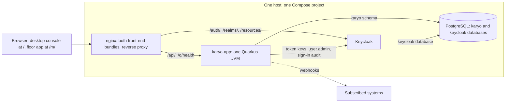

# Architecture overview

The shape of the whole, in one page: what runs, how the backend is assembled, what happens to a
request, and where each part is described in depth. Every section ends in the document or decision
record that owns the detail.

Derived from `infrastructure/docker/docker-compose.prod.yml`, `infrastructure/docker/nginx/nginx.conf`,
`settings.gradle.kts`, `services/karyo-app/build.gradle.kts` and
`services/karyo-app/src/main/resources/application.yaml`.

## What runs

One installation is one host running four containers under Compose, for one operating company
([ADR 0022](decisions/0022-compose-four-container-deployment.md),
[ADR 0014](decisions/0014-silo-tenancy-and-goods-owners.md)).

| Container | What it is |
|---|---|
| `postgresql` | PostgreSQL 16. Karyo's `karyo` database and schema, and Keycloak's own `keycloak` database on the same server (`docker-compose.prod.yml:7`, `:46`) |
| `keycloak` | Keycloak 26, the mandatory identity provider ([ADR 0013](decisions/0013-keycloak-oidc.md)) |
| `karyo-app` | The application: every free module in one JVM, with Flyway migrating the schema at boot |
| `nginx` | Serves both front-end bundles and proxies the API and Keycloak; the only container that publishes a port (`docker-compose.prod.yml:109`) |

nginx routes by path (`infrastructure/docker/nginx/nginx.conf:100-158`):

| Path | Goes to |
|---|---|
| `/api/internal/` | An explicit 404. There is no HTTP between modules, and this prefix is closed so it can never be reached from outside |
| `/api/` | The application |
| `/q/health` | The application's health endpoints. The rest of `/q/`, metrics included, is not proxied |
| `/auth/`, `/realms/`, `/resources/` | Keycloak |
| `/m/` | The floor app |
| `/` | The desktop console |

There is no message broker, no cache server, no API gateway, no service mesh and no vector store.
A deploy replaces the only application instance, so a deploy is an outage.
[Runtime and configuration](runtime-and-configuration.md) and [deploying](../operations/deploying.md)
cover the stack in detail.

## How the backend is assembled

The backend is one Quarkus application, `:services:karyo-app`, and every domain is a library inside
it ([ADR 0001](decisions/0001-modular-monolith.md)). The free build is 44 Gradle subprojects:

| Kind | Count | Examples |
|---|---|---|
| Shared libraries under `libs/` | 6 | `karyo-common` (base entities, warehouse time zone), `karyo-events` (the outbox), `karyo-security` (tenant context and scope), `karyo-license` (the entitlement gate), `karyo-documents`, `karyo-sequence` |
| `-api` modules | 21 | DTOs, SPI interfaces and the event payloads other modules observe, one per domain |
| Free `-core` modules | 14 | Entities, repositories, services and REST resources for inventory, product, layout, auth, orders, tasks, fulfillment, replenishment, stocktaking, work, webhooks, reporting, AI and the document archive |
| Leaves | 2 | `karyo-demo`, off unless enabled; `karyo-inventory-ext-example`, built but assembled only on request |
| The application | 1 | `:services:karyo-app`, which also owns `application.yaml` and every Flyway migration |

A `-core` depends on `-api` modules, never on another module's `-core`, apart from three recorded
waivers ([ADR 0006](decisions/0006-api-and-core-modules.md)). When a dependency would point the wrong
way, the module that needs the answer declares an SPI and the module that has it implements it. The
Gradle graph is not the whole picture: modules also couple through the shared schema, through CDI
events bound by type, and through SPI implementations resolved at runtime.
[Modules and boundaries](modules-and-boundaries.md) maps all four.

The nine commercial engines are not in this repository. When a commercial checkout sits beside this
one, `settings.gradle.kts:150-194` includes them and `services/karyo-app/build.gradle.kts:64-71` adds
them to the application; without one, the loop adds nothing and the image is the free product
([ADR 0020](decisions/0020-free-and-commercial-boundary-per-module.md)). Their `-api` modules, the
seams they implement, their migrations, their configuration keys and their screens are here.
[The commercial boundary](commercial-boundary.md) explains where the line runs.

## A request, end to end

1. nginx passes `/api/...` to the application.
2. Quarkus OIDC validates the bearer token against Keycloak, and the resource's `@RolesAllowed`
   decides whether the caller's role may perform the operation.
3. `TenantFilter` fills a request-scoped `TenantContext` from the token's claims: the goods owner
   (`client_id`), the principal kind (`ops` or `owner`), the username and the roles
   (`libs/karyo-security/src/main/kotlin/com/karyo/security/TenantFilter.kt`).
4. The resource calls a service. A `@Transactional` service method is the unit of work: it reads and
   writes through repositories, calls other modules through injected SPIs, fires CDI events, writes
   outbox rows and inventory journal rows, all in one database transaction.
5. Owner scope comes from `TenantScope`: an OPS principal is unscoped, an OWNER principal sees and
   changes only its own goods owner's rows. Role and principal kind are independent axes
   ([ADR 0015](decisions/0015-principal-kind-independent-of-roles.md)).
6. The response is the resource's DTO, or an RFC 7807 problem document on error
   ([ADR 0017](decisions/0017-versioned-rest-api-and-error-contract.md)).

[Identity and tenancy](identity-and-tenancy.md) covers claims, scope and what enforces isolation;
[the HTTP API surface](../integration/http-api-surface.md) and [the error contract](../integration/api-error-contract.md)
cover the wire.

## Transactions, events and the outbox

- **Between modules, synchronous CDI events.** A module fires a payload declared in its `-api`, and
  every observer chooses its transaction phase: inside the firing transaction when the reaction must
  succeed or fail with the change, after success when it needs the committed state
  ([ADR 0008](decisions/0008-synchronous-rest-and-cdi-events.md)).
- **Out of the process, a transactional outbox.** A change that matters outside is written to
  `outbox_events` in the same transaction. Two readers use it: the webhook relay and the copilot's
  recent-activity tool ([ADR 0009](decisions/0009-transactional-outbox.md)).
- **State is current rows, not events.** Stock is updated in place and every change writes an
  immutable inventory journal row alongside it
  ([ADR 0010](decisions/0010-crud-with-an-inventory-journal.md)).

[Events and the outbox](events-and-outbox.md) and
[webhooks and the event catalogue](../integration/webhooks-and-the-event-catalogue.md) have the detail.

## Persistence

One PostgreSQL database and one `karyo` schema serve every module
([ADR 0004](decisions/0004-one-postgresql-database-and-schema.md)). Flyway migrates it when the
application starts, from seventeen registered migration directories in per-module version bands,
out of order because the bands interleave; applied migrations are immutable, comments included
([ADR 0005](decisions/0005-flyway-migrations-at-boot.md)). Modules refer to each other's rows by id,
never by foreign key ([ADR 0007](decisions/0007-cross-module-references-by-id.md)). Reporting reads
the operational tables directly through SQL views
([ADR 0011](decisions/0011-reporting-reads-the-database-directly.md)). An in-process Caffeine cache
holds reference data only; stock is never cached
([ADR 0012](decisions/0012-caffeine-for-reference-data-only.md)).
[Data and persistence](data-and-persistence.md) and the [data model](../reference/data-model.md) have
the tables.

## Background work

Six scheduled jobs run in the free build:

| Job | What it does | Interval |
|---|---|---|
| `WebhookFanoutScheduler` | Matches new outbox rows to webhook subscriptions | `karyo.webhooks.poll-interval` |
| `WebhookDeliveryScheduler` | Sends due webhook deliveries, with retries | `karyo.webhooks.poll-interval` |
| `KeycloakEventPoller` | Copies sign-in events from Keycloak into the inventory journal | `karyo.auth-audit.poll-interval` |
| `StockPurgeScheduler` | Purges emptied stock units and unit loads | `karyo.inventory.purge.interval` |
| `ReplenishmentScheduler` | Runs the replenishment scan per goods owner; off unless enabled | `karyo.replenishment.scan-interval` |
| `LocationFinderService.sweepExpiredReservations` | Deletes expired putaway reservations | fixed, 60 seconds |

The first five use `ConcurrentExecution.SKIP` so a tick never overlaps the previous one in the same
JVM (for example `.../webhooks/relay/WebhookFanoutScheduler.kt:28`). A scheduled thread has no
request behind it, so jobs pass the goods owner explicitly and use `TenantContext.ownerScoped`
(`libs/karyo-security/src/main/kotlin/com/karyo/security/TenantContext.kt:51`) rather than reading an
ambient context that would silently report owner 0. Several of these jobs assume exactly one
application instance. [Operating an installation](../operations/operating-an-installation.md) covers
running them.

## Configuration

`services/karyo-app/src/main/resources/application.yaml` is the one runtime configuration file.
Environment variables override it, and a runtime property store in the database overrides both for
the settings it knows: a goods owner's own row, then the system owner's row, then configuration, then
the built-in default. [Runtime and configuration](runtime-and-configuration.md) and
[the runtime configuration store](../configuration/runtime-configuration-store.md) describe the
ladder, and [the configuration boundary](../configuration/the-configuration-boundary.md) says which
kind of change belongs where. Tunable warehouse behaviour is expressed through strategies
([ADR 0018](decisions/0018-strategy-driven-configuration.md)).

## Front ends

Two separate React and TypeScript applications, served from the API's own origin: the desktop
console for planners and administrators at `/`, and the floor app for operators at `/m/`
([ADR 0016](decisions/0016-two-frontends-same-origin.md)). Route guards cover the administration
pages only; everything else is authorised at the API. Commercial features have ordinary routes, and
the page decides whether to show a locked panel. [Front ends](frontend.md) has the routing and the
gating.

## Observability

Structured JSON logs on standard output in production
([ADR 0026](decisions/0026-json-structured-logging.md)). Metrics exposed at `/q/metrics` inside the
network, with no collector shipped; tracing present and switched off
([ADR 0025](decisions/0025-metrics-exposed-tracing-off-by-default.md)). Health at `/q/health`, which
the containers and nginx use.

## Extending it

Extensions implement SPIs from the `-api` modules, observe CDI events, set strategy properties or
subscribe to webhooks. They are compiled into the build before Quarkus augmentation; nothing is
uploaded into a running image ([ADR 0019](decisions/0019-extensions-compile-into-the-build.md)).
[Extension SPIs and installation](../integration/extension-spis-and-installation.md) and the
[implementer guide](../guides/implementer-guide.md#extend-the-free-application) show how.

## Where to go next

| To understand | Read |
|---|---|
| Why each of these choices was made | [Decision records](decisions/README.md) |
| The rules a change must not break | [Architecture guide](../guides/architecture-guide.md) |
| What Karyo does in a warehouse | [docs/README.md](../README.md#what-karyo-does-in-a-warehouse) |
| How the tests are organised | [Testing](testing.md) |
| How to run it locally | [Developer onboarding](../guides/developer-onboarding.md) |
