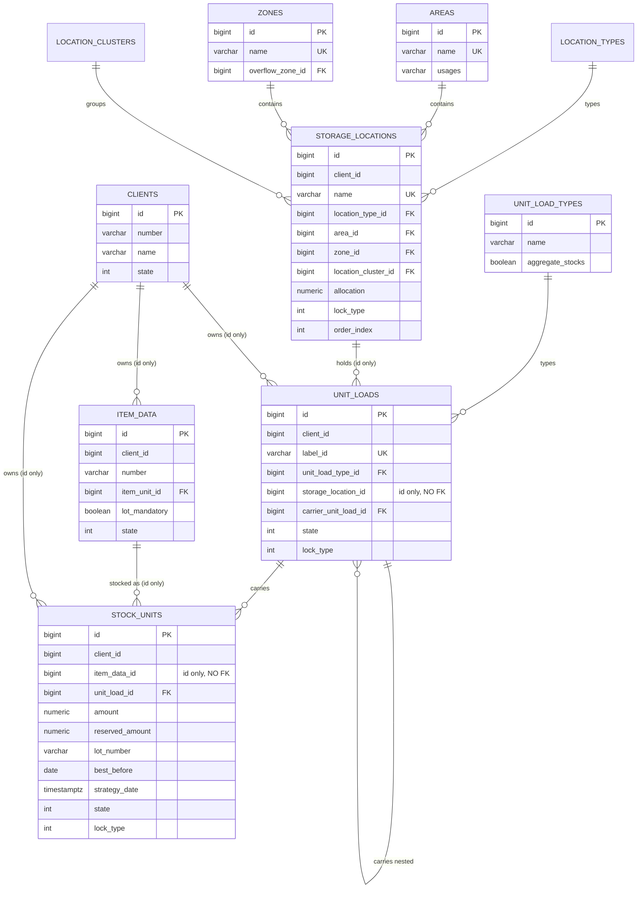
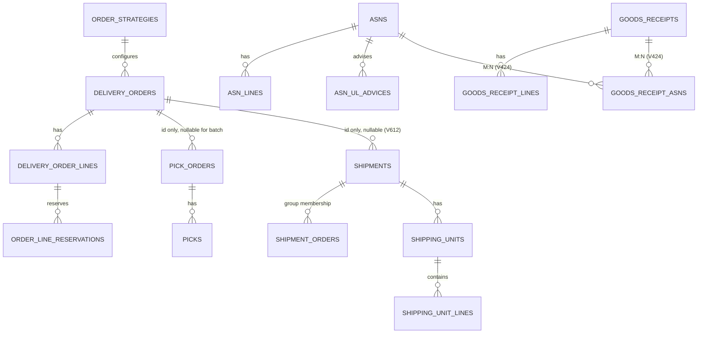

# Data model

The persistent model: what the tables are, how they group into aggregates, which relationships
are real foreign keys and which are not, and how Flyway is organised. The *meaning* of the stock
nouns is in [stock model and states](../functional/stock-model-and-states.md); this page is about
the storage. It is written for engineers.

## One schema, module-owned tables

Everything lives in one PostgreSQL schema, `karyo`, in one database, reached through one Hibernate
persistence unit and one datasource (`services/karyo-app/src/main/resources/application.yaml`).
Keycloak has its own separate database, `keycloak`, on the same server.

Ownership is by convention, not by permission: each module owns a table range and no other module's
code touches those tables. Cross-module access goes through SPI lookups.

There are **70 distinct table names** created across the migrations (69 tables plus the one
`inventory_journals_default` partition) and **5 views**.

| Module | Tables |
|---|---|
| common (events, sequence) | `outbox_events`, `sequence_numbers` |
| inventory | `stock_units`, `unit_loads`, `unit_load_types`, `inventory_journals` (+ `inventory_journals_default`), `inactive_products` |
| product | `item_data`, `item_data_numbers`, `item_units`, `packaging_units`, `item_substitutions` |
| layout | `zones`, `areas`, `storage_locations`, `location_types`, `location_clusters`, `location_reservations`, `storage_strategies`, `fix_assignments`, `storage_areas`, `storage_area_clusters`, `storage_strategy_areas`, `item_data_areas`, `type_capacity_constraints`, `working_areas`, `working_area_clusters` |
| orders | `asns`, `asn_lines`, `asn_ul_advices`, `goods_receipts`, `goods_receipt_lines`, `goods_receipt_asns`, `delivery_orders`, `delivery_order_lines`, `order_line_reservations`, `order_strategies` |
| tasks | `transport_orders` |
| fulfillment | `pick_orders`, `picks`, `shipments`, `shipment_orders`, `shipping_units`, `shipping_unit_lines` |
| stocktaking | `count_sessions`, `count_orders`, `count_lines`, `count_campaigns` |
| work | `work_groups`, `work_group_members` |
| webhooks | `webhook_subscription`, `webhook_delivery`, `webhook_fanout_cursor` |
| reporting | `report_definitions`, plus 5 views |
| monitors *(commercial)* | `monitor_config`, `alerts`, `alert_deliveries` |
| auth | `clients`, `system_properties`, `auth_event_cursor` |
| docstore | `documents` |
| document templates *(commercial)* | `document_templates` (its migration sits in the `docstore` band, V1302) |
| crossdock *(commercial)* | `cross_dock_orders` |
| wave *(commercial)* | `waves`, `consolidation_groups`, `consolidation_lines`, `sort_scans`, `wave_selection_rules` |
| streaming *(commercial)* | `stream_batches` |

The tables marked *(commercial)* belong to engines that are not in this repository. Their
migrations are, and every build registers them, so a free installation creates these tables and
leaves them empty. See [the commercial boundary](../architecture/commercial-boundary.md).

Five modules own no table at all and compute on demand: **forecasting**, **slotting**,
**simulation**, **replenishment** and **cartonization**. Forecasting, slotting and simulation read
the fulfillment `picks` table as their demand history. Replenishment reads layout and inventory and
writes `transport_orders` through the tasks SPI. Cartonization is a single `PackoutStrategy` bean
that plans boxes from the caller's pick data and persists nothing of its own.

## The base classes

Two `@MappedSuperclass` types in `libs/karyo-common/src/main/kotlin/com/karyo/common/domain/BaseEntity.kt`:

```kotlin
BaseEntity      // id (IDENTITY), version (@Version), created, modified
  TenantEntity  // + clientId, plus a Hibernate @FilterDef/@Filter "tenantFilter" that is never enabled
```

Four consequences that shape everything:

1. **Optimistic locking is universal.** Every entity carries `@Version`. Concurrent edits produce
   an `OptimisticLockException`, which several schedulers catch and treat as "someone else got
   there first".
2. **`created` and `modified` are plain assignable fields**, not `@CreationTimestamp` or
   `@UpdateTimestamp`. That is what makes the demo generator's backdating possible: it simply
   assigns a past instant.
3. **`TenantEntity.clientId` defaults to `0`**, which is also the system client's id. This is why
   an unprimed `TenantContext` on a scheduler thread is a silent wrong-tenant read rather than an
   error.
4. **The `tenantFilter` declared on `TenantEntity` is never enabled**, so the database adds no owner
   condition to anything. Owner scoping is enforced in application code, through the request-scoped
   `TenantContext` and `readScope()`/`writeScope()`. The filter is off deliberately and should stay
   off: Hibernate filters do not apply to primary-key lookups such as `find()` and `findById()`,
   this codebase is `findById`-heavy, and native queries bypass filters entirely, so it would look
   airtight in review and leak on the most common call. **Your queries need the owner predicate,
   because nothing beneath them adds it** - see
   [what actually enforces isolation](../architecture/identity-and-tenancy.md#what-actually-enforces-isolation).

`Client` is the one domain entity that extends `BaseEntity` and not `TenantEntity`, because a
client *is* the tenant dimension.

## The core entity relationships

The stock-and-place cluster, which is what most of the system is about:



And the order-to-shipment chain:



Two nullability rules are load-bearing, and both exist for the commercial wave engine:

- **`pick_orders.delivery_order_id` is null for a batch pick order.** A cross-order batch pick
  belongs to a wave, not to one order, and it carries `wave_id` and `batch_zone` instead. It
  follows the same shape as an `EXTINGUISH` pick, which also has no backing order (fulfillment
  V610).
- **`shipments.delivery_order_id` is nullable (V612).** A group shipment covers several orders
  and names them through the `shipment_orders` join table. `ShippingUnitLine` carries
  `delivery_order_id` and `delivery_order_line_id` so each carton line still knows whose it is.

## Aggregates

There are no explicit aggregate-root annotations; the boundaries are visible in which entity a
service transacts over and where real foreign keys stop.

| Aggregate | Root | Members | Boundary |
|---|---|---|---|
| Stock | `UnitLoad` | `StockUnit` (`optional = false` back-reference), nested `UnitLoad`s | Location and item are crossed by id only |
| Item | `ItemData` | `ItemDataNumber`, `PackagingUnit` | |
| Place | `StorageLocation` | none; `Area`, `Zone`, `LocationType`, `LocationCluster` are shared references | |
| Inbound expectation | `Asn` | `AsnLine`, `AsnUlAdvice` | |
| Inbound reality | `GoodsReceipt` | `GoodsReceiptLine`; `GoodsReceiptAsn` joins to the expectation | |
| Outbound demand | `DeliveryOrder` | `DeliveryOrderLine`, `OrderLineReservation` | |
| Pick work | `PickOrder` | `Pick` | |
| Shipment | `Shipment` | `ShippingUnit`, `ShippingUnitLine`, `ShipmentOrder` | |
| Move | `TransportOrder` | none, a flat entity | |
| Count | `CountSession` | `CountOrder`, `CountLine`; `CountCampaign` sits above sessions | |
| Wave *(commercial)* | `Wave` | `ConsolidationGroup`, `ConsolidationLine`, `SortScan` | |

## References that are not foreign keys

This is the rule that most surprises newcomers:

> **Cross-module references are ids only. No foreign key crosses a module boundary.**

It preserves the option of splitting a module out again, and it is why the schema cannot enforce
integrity that a monolithic schema easily could. See
[ADR 0007](../architecture/decisions/0007-cross-module-references-by-id.md).

The important ones:

| Column | Points at | Validated by |
|---|---|---|
| `unit_loads.storage_location_id` | `storage_locations.id` | Nothing at the database level; the moving code resolves the location first. `storage_location_name` is denormalised alongside. |
| `stock_units.item_data_id` | `item_data.id` | `ProductLookup` at write time. `item_data_number` is denormalised alongside. |
| `delivery_orders.destination_location_id`, `order_strategies.default_destination_location_id` | `storage_locations.id` | `StorageLocationLookup` via `DestinationLocationResolver` |
| `pick_orders.delivery_order_id` | `delivery_orders.id` | `DeliveryOrderLookup` |
| `transport_orders.goods_receipt_line_id` | `goods_receipt_lines.id` | The receiving event carries it |
| `asn_lines.cross_dock_delivery_order_id` | `delivery_orders.id` | The commercial cross-docking engine |
| **Everything's `client_id`** | `clients.id` | **Nothing.** Deliberately: no foreign key anywhere references `clients`. |

The `clients` case is the most deliberate. Integrity is *advisory*, reported by
`GET /api/v1/clients/consistency`, which discovers every table carrying a `client_id` by scanning
`information_schema`, filtered to `BASE TABLE` because the schema also has KPI views with the same
column.

## Special tables

### `inventory_journals` is partitioned

```sql
CREATE TABLE inventory_journals (...)
  PRIMARY KEY (id, created)
) PARTITION BY RANGE (created);

CREATE TABLE inventory_journals_default PARTITION OF inventory_journals DEFAULT;
```

The primary key is composite `(id, created)`, because PostgreSQL requires the partition key in the
primary key. Only the default partition exists, so all rows land there.

**Gap.** Nothing creates time-range partitions. There is no partition-management job, migration or
scheduled task. As it stands the partitioning is structural preparation, not an active retention
mechanism.

Journal columns are `updatable = false` on the entity: a row is written once and never changed.

### `outbox_events` is an active event log with delivery and activity readers

Domain mutation paths append events through `OutboxService.publish`
(`libs/karyo-events/src/main/kotlin/com/karyo/events/outbox/OutboxService.kt`): aggregate type,
aggregate id, event type, JSONB payload, tenant id, `published` flag.

Its live consumers are the webhook fanout relay and the copilot's recent-activity tool. See
[events and the outbox](../architecture/events-and-outbox.md).

### `system_properties` overrides environment configuration by design

The runtime-settings store (`auth` V1202). `RuntimePropertyLookup` resolves in this order:

1. the stored row for this key and this `clientId`,
2. the stored client-0 row,
3. the MicroProfile config value for the same key (which is where an environment variable lands),
4. the caller-supplied default.

So a database row silently beats an environment variable, and that is intentional: the environment
variable is the fallback, not the authority. Sixteen keys are catalogued in
`services/auth-service/karyo-auth-core/src/main/kotlin/com/karyo/auth/config/SystemPropertyCatalog.kt`,
each with a type, a group, a default, and an `ownerWritable` flag. See
[the runtime configuration store](../configuration/runtime-configuration-store.md).

### `order_strategies.extension_properties` is a JSONB relief valve

Rather than a migration per new flag, newer configuration lands as keys in a JSONB column. Wave and
streaming configuration live entirely there. The keys are listed in
[strategies and policies](../configuration/strategies-and-policies.md#what-is-a-column-and-what-is-loose-json).

### KPI views, not tables

`reporting` owns five SQL views, not materialised, computed at query time
(`services/karyo-app/src/main/resources/db/migration/reporting/`):

| View | What it reports |
|---|---|
| `kpi_throughput_daily` | Daily throughput; see the reporting interpretation linked below |
| `kpi_accuracy_daily` | Count accuracy per day |
| `kpi_cycle_time_daily` | Order cycle time per day |
| `kpi_utilization_current` | Point-in-time location utilisation |
| `kpi_location_occupancy` | Per-location occupancy for the heatmap, plus capacity (V1006) |

Their **output columns are a locked contract**, stated in the migration comments. V1006 amends
`kpi_location_occupancy` with `CREATE OR REPLACE` and is explicitly append-only: V1005's select
list is reproduced verbatim and exactly two columns are added. No column is dropped, reordered or
retyped. Follow that discipline for any future view change.

The [reporting module's README](../../services/reporting-service/karyo-reporting-core/README.md#schema-and-calculation-owners)
owns KPI interpretation and migration-chain caveats. A migration's comments are not an inventory of
the current schema or a guarantee that a column measures physical quantities.

## Migrations

`services/karyo-app/src/main/resources/application.yaml` owns Flyway configuration and the exact
locations list (`application.yaml:40`). It registers every band in the table below, including the
four that belong to commercial engines (`monitors`, `crossdock`, `wave`, `streaming`), in the free
build as in the full one.

Migration directories live under `services/karyo-app/src/main/resources/db/migration/`.
Migrations belong to the aggregator, not to the module whose tables they create - a module jar
has no Flyway location of its own. See
[ADR 0005](../architecture/decisions/0005-flyway-migrations-at-boot.md).

### Version bands

One global numbering space, partitioned by module so versions never collide:

| Band | Module | Directory | Count | Range in use |
|---|---|---|---|---|
| V1-V99 | common (outbox, sequence) | `common` | 2 | V1-V2 |
| V1xx | inventory | `inventory` | 11 | V101-V111 |
| V2xx | product | `product` | 7 | V201-V207 |
| V3xx | layout | `layout` | 18 | V301-V318 |
| V4xx | orders | `orders` | 31 | V401-V431 |
| V5xx | tasks | `tasks` | 8 | V501-V508 |
| V6xx | fulfillment | `fulfillment` | 13 | V601-V613 |
| V7xx | stocktaking | `stocktaking` | 4 | V701-V704 |
| V8xx | work | `work` | 1 | V801 |
| V9xx | webhooks | `webhooks` | 1 | V901 |
| V10xx | reporting | `reporting` | 6 | V1001-V1006 |
| V11xx | monitors *(commercial)* | `monitors` | 4 | V1101-V1104 |
| V12xx | auth | `auth` | 3 | V1201-V1203 |
| V13xx | crossdock *(commercial)* and docstore | `crossdock`, `docstore` | 1 + 2 | V1300; V1301-V1302 |
| V14xx | wave *(commercial)* | `wave` | 3 | V1400-V1402 |
| V15xx | streaming *(commercial)* | `streaming` | 1 | V1500 |

Note that **crossdock and docstore share the V13xx band**: crossdock has V1300, docstore has V1301
and V1302. They are in different directories, so a future migration in either has to check the other
before choosing a number.

### Four rules and one trap

**1. Forward-only.** No `R__` repeatable migrations, no down migrations. A mistake is corrected by a
new migration, never by editing an applied one. Editing an applied file produces a Flyway checksum
mismatch, whose only fixes are `--reset-db` (destroying data) or a corrective migration.

**2. `out-of-order: true` is mandatory, not optional.** Because bands interleave, a new low-band
migration - say layout V319 - sorts *before* already-applied higher-band migrations such as orders
V431 on a long-lived database. Flyway rejects that unless out-of-order is on. Fresh databases (Dev
Services, tests) never hit it, so the failure only appears on a real deployment.

**3. A new migration directory must be registered in `quarkus.flyway.locations`.** This is the trap.
A migration in an unregistered directory **silently never runs**: no warning, no error, just a
missing table at runtime. Adding a module means editing that list, not just creating the folder.

**4. Data migrations must be defensive.** Wave V1402 widens `consolidation_groups.destination_key`
and backfills three-part keys best-effort, warning about what it cannot convert. When a migration
changes the meaning of stored data rather than its shape, the migration says what it could not do
rather than guessing.

### Seed data in migrations

Several migrations seed rows, so a fresh deployment is usable:

- `clients` seeds ids 0, 1 and 2 (SYS, ACME, GLOBEX, matching the `tenant_code` JWT claim) and
  pushes the identity sequence to 100 so generated ids can never collide with a seeded row.
- `unit_load_types` seeds default types (`inventory/V105__seed_unit_load_types.sql`), including
  the "Pick Bin" type with `aggregate_stocks = TRUE` that pick containers default to.
- `order_strategies` seeds a default strategy (`orders/V405__seed_default_order_strategy.sql`).
- `item_units` seeds base units of measure (`product/V201__create_item_units.sql`).

The demo reset (`POST /api/v1/demo/reset`) truncates operational and catalog tables but preserves
the reference seeds by leaving them out of its truncate list: `item_units`, `unit_load_types`,
`order_strategies` and `monitor_config` among them.

## Working with the schema

| Task | How |
|---|---|
| Add a table | New migration in the owning module's directory, in its band. Add the entity, extending `TenantEntity` unless it *is* the tenant dimension. |
| Add a module | Create the directory **and add it to `quarkus.flyway.locations`**, in a fresh band. Add `META-INF/beans.xml` to the core. |
| Fix an applied migration | Never edit it. Write a new one. |
| Reference another module's row | Id column, no foreign key, validate through that module's lookup SPI on the write path |
| Reset a development database | `./scripts/deploy-server.sh --reset-db`, or drop the Dev Services volume |
| Check tenant consistency | `GET /api/v1/clients/consistency` |

## Related

- [Stock model and states](../functional/stock-model-and-states.md) - what these entities mean
- [Modules and boundaries](../architecture/modules-and-boundaries.md) - which module owns what
- [Data and persistence](../architecture/data-and-persistence.md) - the persistence configuration
- [ADR 0004](../architecture/decisions/0004-one-postgresql-database-and-schema.md) - one database, one schema

## Sources

- `services/karyo-app/src/main/resources/db/migration/` - table definitions and migration bands
- `services/karyo-app/src/main/resources/db/migration/inventory/V105__seed_unit_load_types.sql`,
  `orders/V405__seed_default_order_strategy.sql`, `product/V201__create_item_units.sql` and
  `auth/V1201__create_clients.sql` - the seed migrations
- `services/karyo-app/src/main/resources/application.yaml` - authoritative Flyway configuration
- `libs/karyo-common/src/main/kotlin/com/karyo/common/domain/BaseEntity.kt` - the two base classes
- `services/karyo-app/src/main/resources/db/migration/inventory/V102__create_unit_loads.sql`,
  `V103__create_stock_units.sql` and `V104__create_inventory_journals.sql` - the missing foreign
  keys, the `CHECK` constraints, and the journal partitioning
- `services/karyo-app/src/main/resources/db/migration/layout/V305__create_storage_locations.sql`
- `services/karyo-app/src/main/resources/db/migration/auth/V1202__create_system_properties.sql` -
  the settings store
- `services/karyo-app/src/main/resources/db/migration/reporting/` - the views and their locked
  column contract
- `services/karyo-app/src/main/resources/db/migration/fulfillment/` (V610-V612) and
  `wave/V1402__sort_station.sql` - the nullability rules and the defensive backfill
- `services/auth-service/karyo-auth-core/src/main/kotlin/com/karyo/auth/config/SystemPropertyCatalog.kt`
  and `services/auth-service/karyo-auth-core/src/main/kotlin/com/karyo/auth/domain/model/Client.kt`
- `services/auth-service/karyo-auth-api/src/main/kotlin/com/karyo/auth/spi/RuntimePropertyLookup.kt` -
  the four-step resolution ladder
- `services/demo-service/karyo-demo/src/main/kotlin/com/karyo/demo/service/DemoDataService.kt` -
  what the demo reset preserves
- Every `@Entity` class under `services/` and `libs/` - the aggregate table
